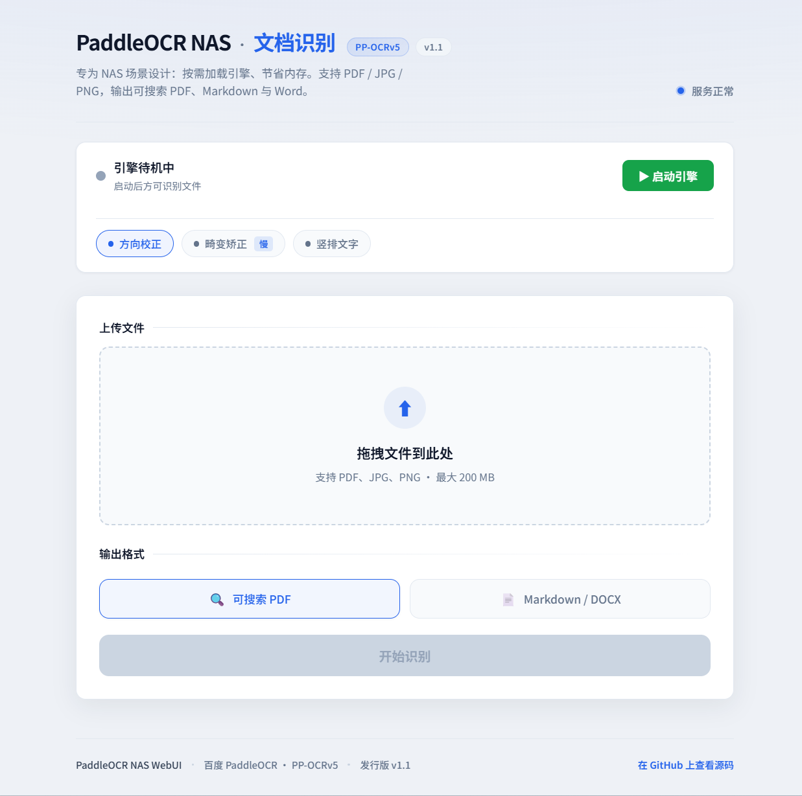

# PaddleOCR-NAS-WebUI

这是一项专为 NAS (Network Attached Storage) 用户打造的高精度文字识别（OCR）解决方案。集成百度 **PaddleOCR PP-OCRv5** 顶级引擎，支持 PDF、JPG、PNG 多格式输入，并针对家庭服务器资源受限的场景，独创了"壳核分离"的内存管理架构。
### 界面预览



---

## ✨ 核心特色

* **🏆 顶级精度**：内置 PaddleOCR PP-OCRv5 模型（paddleocr 3.x + paddlepaddle 3.3.1），识别率远超传统 Tesseract 方案，支持复杂排版、中英混排及手机拍摄扫描件。
* **📂 多格式输入**：支持 PDF（含文字层自动检测）、JPG、PNG 图片直接上传识别。
* **🧠 智能三路分支**：
    * **PDF 有文字层** → 直接提取文字层，跳过 OCR，速度极快且顺序精准。
    * **PDF 纯图片** → OCR + Y 中心点聚类行分组，解决手机拍摄畸变导致的排序乱问题。
    * **JPG / PNG** → 单图 OCR，同样使用聚类行分组算法。
* **🧠 壳核分离架构**：
    * **低功耗常驻**：默认仅启动 Web 壳程序（约 100MB 内存），不占用大宗资源。
    * **按需加载**：通过前端开关手动开启 OCR 引擎，加载后占用约 1.4GB 内存（较 v4 节省 1.2GB）。
    * **自动释放**：任务结束或闲置 1 小时后，利用 `malloc_trim` 强制归还系统内存。
* **🧹 页眉页脚清理**：Markdown/DOCX 模式下提供可选开关，自动过滤页码、标题等边缘干扰内容。
* **📄 全能输出**：支持生成可搜索 PDF、高质量 Markdown 以及 DOCX 文档。
* **⚙️ 动态参数控制**：OCR 推理增强选项（方向分类、畸变矫正）均通过环境变量控制，修改 `docker-compose.yml` 重启即生效，无需重新构建镜像。

---

## 🛠️ 部署指南 (Docker Compose)

推荐在 iStoreOS、群晖、威联通等支持 Docker 的 NAS 系统中部署。

### 前置条件

- 已安装 **Docker Engine** 与 **Docker Compose**（Compose V2，命令为 `docker compose`）。
- NAS 或宿主机建议 **x86_64**，内存建议 **≥ 4 GB**（OCR 引擎加载后峰值约 1.4GB，Compose 中容器上限为 8GB，可按机器调整）。
- 确保 **5003** 端口未被占用（或按下方说明修改映射端口）。

### 获取代码

```bash
git clone https://github.com/xfghvgnfyjssjgte/Paddle-OCR-NAS.git pdf-ocr
cd pdf-ocr
```

### 构建并启动

```bash
docker compose up -d --build
```

- 首次构建会下载 PaddlePaddle 依赖并预拉 PP-OCRv5 模型（含方向分类、畸变矫正模型），**耗时较长**，属正常现象。
- `-d` 表示后台运行；`--build` 强制根据当前代码重新构建镜像。

### 访问 Web 界面

```text
http://<NAS_IP>:5003
```

本机测试：

```text
http://127.0.0.1:5003
```


### 常用运维命令

| 说明 | 命令 |
|------|------|
| 查看运行状态 | `docker compose ps` |
| 查看日志（跟随输出） | `docker compose logs -f` |
| 仅查看近 100 行 | `docker compose logs --tail=100` |
| 重启服务 | `docker compose restart` |
| 停止并删除容器（保留镜像与卷） | `docker compose down` |
| 停止并删除容器与卷（会清空模型缓存，慎用） | `docker compose down -v` |

---

## ⚙️ 环境变量说明

在 `docker-compose.yml` 的 `environment` 中修改，**仅重启即可生效**（无需重新 build）：

```bash
docker compose restart
```

### 基础配置

| 变量 | 含义 | 默认值 |
|------|------|--------|
| `CPU_THREADS` | Paddle 使用的 CPU 线程数 | `14` |
| `OCR_DPI` | PDF 渲染 DPI，越大越清晰越慢 | `200` |
| `MAX_UPLOAD_MB` | 单文件上传上限（MB） | `200` |
| `MAX_FILE_AGE` | 输出文件保留时间（秒） | `3600` |
| `MIN_CONFIDENCE` | OCR 最低置信度（0–1） | `0.5` |
| `TEXT_LAYER_MIN_CHARS` | PDF 文字层判断阈值（字符数） | `20` |
| `MODEL_IDLE_TIMEOUT` | OCR 引擎闲置自动卸载时间（秒） | `3600` |

### PP-OCRv5 推理增强开关

> 修改后执行 `docker compose restart` 即生效，无需重新 build。

| 变量 | 含义 | 默认值 | 建议 |
|------|------|--------|------|
| `USE_DOC_ORIENTATION` | 文档方向分类，检测横拍/倒置文档 | `true` | 开启，防止横拍乱码 |
| `USE_DOC_UNWARPING` | 文档畸变矫正，修正手机拍摄的梯形/弯曲变形 | `true` | 开启，显著提升扫描件识别率 |
| `USE_TEXTLINE_ORI` | 行级文字方向，用于竖排文字场景 | `false` | 纯文字文书无需开启 |

**示例**（关闭畸变矫正以加快速度）：

```yaml
environment:
  - USE_DOC_UNWARPING=false
```

启动日志中会打印当前生效参数，方便确认：

```
Model: Loading PaddleOCR (PP-OCRv5, CPU)… orientation=True unwarping=True textline_ori=False
```

---

## 📦 版本说明

| 组件 | 版本 |
|------|------|
| PaddlePaddle | 3.3.1 |
| paddleocr | 3.x（不锁版本，自动拉最新） |
| PP-OCRv5 模型 | server 级（det + rec） |
| PyMuPDF | 1.24.14 |
| Flask | 3.1.0 |
| Python | 3.12 |
| 基础镜像 | ubuntu:24.04 |

---

## 🔧 修改端口

编辑 `docker-compose.yml`：

```yaml
ports:
  - "5003:5000"   # 将左侧改为你需要的宿主机端口
```

保存后执行：

```bash
docker compose up -d
```
